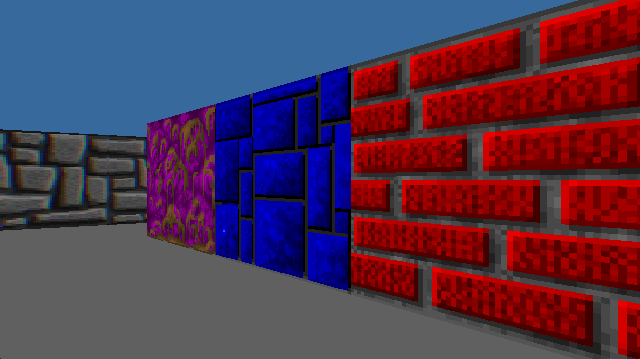
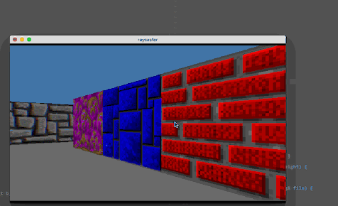

# Raycaster

A WIP old school ray casting program.






## Compiling

**Note: This project is very much a WIP. It is being developed on OSX El
Capitan (10.11.4) and the `Makefile` has not been configured to locate SDL2
correctly on other platforms. Cross platform support is on my TODO list.**

This project is dependent on SDL2, which must first be installed at https://www.libsdl.org/download-2.0.php. 
Download the runtime binaries for your operating system and install. 

Once SDL2 is available, clone this repository.

```sh
git clone https://github.com/adelciotto/raycaster.git
```

Change into the cloned directory and run make.

```sh
cd raycaster
make
```

Then run the `rayc` executable.

```sh
./rayc
```

## Command-line arguments

```
-width <uint>  // The window width, defaults to 640.
-height <uint> // The window height, defaults to 360.
-fullscreen    // Whether or not to run in fullscreen mode. Defaults to off.
-novsync       // Disable vsync. VSync is enabled by default.
-map <string>  // The map file to load. Defaults to assets/maps/small.txt.

// example
./rayc -width 1280 -height 720 -fullscreen -map assets/maps/somemap.txt
```

## Third-party code

- [SDL2](https://www.libsdl.org/download-2.0.php)
- [Generic Makefile](https://github.com/mbcrawfo/GenericMakefile) by [mbcrawfo](https://github.com/mbcrawfo)

## Resources

- [lodev.org](http://lodev.org/cgtutor/raycasting.html)
- [permadi.com](http://permadi.com/1996/05/ray-casting-tutorial-table-of-contents/)
- [Chocolate Wolfenstein 3D](https://github.com/fabiensanglard/Chocolate-Wolfenstein-3D)
